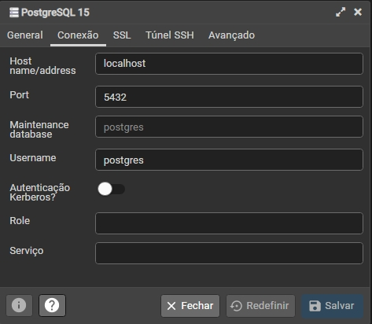

# PostgreSQL: administração e otimização do banco

Aprendendo quais são os papéis de um DBA; entendendo como um banco de dados funciona na arquitetura cliente-servidor; aprendendo a gerenciar o serviço do banco de dados; entendendo sobre a administração e otimização do ambiente, do hardware até o software; conhecendo na prática alguns processos de manutenção de bancos de dados; aprendendo com detalhes e na prática sobre backup; otimizando queries utilizando o planejador de queries e índices; mantendo o ambiente seguro gerenciando acessos, usuários, permissões.

1. [Papel do DBA](#1-papel-do-dba)
2. [Servidor Postgres](#2-servidor-postgres)
3. [Tuning de banco](#3-tuning-de-banco)
4. [Processos de manutenção](#4-processos-de-manutenção)
5. [Backup e restauração](#5-backup-e-restauração)
6. [Planejamento de queries](#6-planejamento-de-queries)
7. [Usuários e permissões](#7-usuários-e-permissões)

Saiba mais sobre o curso [aqui](https://cursos.alura.com.br/course/postgresql-administracao-otimizacao) ou acompanhe minhas anotações abaixo. ⬇️

## 1. Papel do DBA

### **Responsabilidades de um DBA**

- Avaliar e instalar o ambiente;
- Manter o banco de dados performático;
- Manter os dados através de processos de backup;
- Auxiliar a área de desenvolvimento na manutenção dos dados;
- Monitorar o ambiente de instalação;
- Configurar o ambiente de dados;Configurar o acesso à base de dados;
- Administrar os usuários e seus acessos.

### **Conexões com o banco**

> Os programas que desenvolvedores criam e que acessam o banco de dados também são clientes.
> 
> Se vários usuários acessarem o sistema, teremos várias conexões sendo feitas com o banco de dados.



## 2. Servidor Postgres

### **Inicializando um espaço**

> Um cluster inicializado pelo comando `initdb` é o local onde o PostgreSQL vai armazenar os arquivos necessários para representar o esquema e seus dados.

***Comando para inicializar o cluster:***

    initdb -D /usr/local/pgsql/data

***Comando para subir o servidor:***

    postgres -D /usr/local/pgsql/data

***Comando para subir o servidor com redirecionamento de saída:***

    postgres -D /usr/local/pgsql/data >logfile 2>&1 &

O `pg_ctl` é um utilitário para iniciar, parar ou reiniciar o servidor PostgreSQL ou mostrar o status de um servidor ativo.

***Comando para iniciar o servidor:***

    pg_ctl start -l logfile

**Outras ações com pg_ctl**

- `start` inicia
- `stop` para
- `restart` reinicia
- `reload` recarrega
- `status` visualiza

**Para saber mais:** [pg_ctl](Para%20saber%20mais/Aula%202%20-%20Atividade%204%20Para%20saber%20mais_%20pg_ctl.pdf)

### **Derrubando o servidor**

É possível parar o servidor através do pg_ctl, porém é importante saber quando interromper a execução do servidor. O motivo mais comum é o caso de manutenção física, em que é necessário desligar ou reiniciar o servidor. O ideal é interromper o serviço do PostgreSQL para garantir que nada seja perdido.

Caso o servidor esteja sendo atacado é imprescindível derrubá-lo para impedir dano ou roubo de informações. Mantendo inativo até que a falha seja investigada e corrigida.

***Comando para parar o servidor:***

    pg_ctl stop

> Ao não permitir o seu uso como root, o pg_ctl se “autolimita” garantindo que ele não terá acesso a coisas que não deveria. Isso é uma camada a mais de segurança ao servidor.

## 3. Tuning de banco

### **Tuning de hardware e nuvem**

Tuning é a otimização do banco de dados e ela pode ser feita no hardware, no banco de dados e/ou no sistema operacional. Tendo isso em mente, é necessário verificar alguns pontos, descritos abaixo:

- Preferência a processadores e sistemas 64bits;
- Analisar a relação entre RAM e a base de dados;
- Ver o tipo de leitura do disco;
- Usar RAID.

> Um DBA possui diversas funções e gerenciar o hardware e o SO são apenas parte dessas funções.
> Serviços em nuvem como Azure, Amazon, Google Cloud podem tirar uma parte do fardo do DBA.
> Porém um DBA ainda se faz muito necessário para manutenção, otimização, backup, etc.

### **Configurações do PostgreSQL**

***Parâmentros de interação via arquivo de configuração:***

- shared_buffers
  - quantidade de memória dedicada ao cache
  - 15% a 25% do total de RAM
- work_mem
  - quantidade de memória dedicada a operações como ordenação
  - 25% do total de RAM / max_connections
- maintenance_work_mem
  - quantidade de memória dedicada a operações de manutenção
  - 5% do total de RAM

***Algumas configurações para o servidor do PostgreSQL:***

    log_connections = yes
    log_destination = stderr
    shared_buffers = 4GB

**Para saber mais:** [Configurações](Para%20saber%20mais/Aula%203%20-%20Atividade%204%20Para%20saber%20mais_%20Configurações.pdf)

## 4. Processos de manutenção

> Por questões de performance é bem mais rápido para o PostgreSQL executar uma query gerenciando dados excluídos e atualizados, mantendo algumas informações desatualizadas e, digamos, inúteis. Isso causa menos verificações.

### **Conhecendo o VACUUM**

O `VACUUM` serve para coletar o lixo. Ele também analisa um banco de dados para isso.

- `VACUUM FULL` trava a base de dados e reescreve todo o conteúdo da tabela em um novo arquivo de disco
- `VACUUM VERBOSE` imprime um relatório detalhado da atividade de limpeza para cada tabela
- `VACUUM ANALYZE` atualiza as estatísticas para determinar a maneira mais eficiente de executar uma consulta

***Quando usar cada comando?***

O VACUUM normalmente só é utilizado quando o autovacuum por algum motivo não fizer seu trabalho.

O VACUUM FULL é utilizado quando temos muito desperdício de espaço. Normalmente quando a maioria dos registros de uma tabela já foram excluídos ou alterados.

O VACUUM ANALYSE é um comando a parte. Então o VACUUM faz seu trabalho e depois chama esse outro comando para que ele possa analisar a estrutura e os dados das tabelas e atualizar as estatísticas para o planejador de query.

***VACUUM vs VACUUM FULL***

VACUUM                        | VACUUM FULL
----------------------------- | -----------------------------
Verifica apenas tuplas mortas | Verifica todas as tuplas
Não bloqueia acesso           | Requer acesso exclusivo
Lança memória para a tabela   | Lança memória para o sistema
Não reordena os indexes       | Reordena os indexes
Não necessita de mais espaço  | Precisa do dobro do espaço

### **Processos de manutenção**

O `REINDEX` atualiza a tabela de índices. Muito útil nos casos em que os registros foram excluídos e não mais existem na tabela, mas seu espaço na memória permanece.

```sql
REINDEX TABLE instrutor;
```

## 5. Backup e restauração

### **Processos de backup (exportação)**

Backup é a cópia dos arquivos e registros de um banco.

- Backup frio
  - servidor inativo, nenhuma conexão permitida
- Backup morno/quente
  - servidor ativo, conexões ativas acontecendo
- Backup lógico
  - cópia da estrutura e dos dados
- Backup físico
  - cópia dos arquivos binários utilizados

***Comando para realizar o backup:***

  pg_dump -f /tmp/dump.sql

***Comandos para ler o arquivo do bakcup:***

  /tmp/dump.sql
  more /tmp/dump.sql

### **Restaurando backups (importação)**

O arquivo dos backups realizados podem ser importados para o banco em caso de perda de registros.

***Comando para restaurar o backup:***

  psql alura < /tmp/dump.sql

## 6. Planejamento de queries

### **Plano de execução (EXPLAIN)**

O comando `EXPLAIN` explica o que o PostgreSQL faz com a query que foi executada. No caso abaixo, ele faz a busca de instrutores totais, para só depois realizar o filtro pelos salários.

```sql
EXPLAIN SELECT * FROM instrutor WHERE salario > 1500;
```

**Para saber mais:** [EXPLAIN](Para%20saber%20mais/Aula%206%20-%20Atividade%202%20Para%20saber%20mais_%20EXPLAIN.pdf)

### **Criando um índice**

O comando `CREATE INDEX` cria um índice na coluna especificada de uma tabela. Os índices são usados ​​principalmente para aprimorar o desempenho do banco de dados.

```sql
CREATE INDEX idx_salario ON instrutor(salario);
```

O comando `REINDEX` realiza uma nova organização em uma índice existente. Um índice pode ser organizado a partir de um índice criado anteriormente, uma tabela, esquema, base de dados, nome específico.

***Quando não utilizar índices:***

> Em queries simples, índices podem acabar informando ao PostgreSQL que mais trabalho precisa ser feito, deixando a query mais custosa. Use índices com moderação.
>
> Sempre que inserir, atualizar ou remover um registro, os índices precisar ser reorganizados. Isso custa tempo e processamento. Use índices com moderação.

## 7. Usuários e permissões

### **Arquivo pg_hba**

A autenticação do cliente é controlada pelo arquivo de configuração `pg_hba.conf`. Ele fica armazenado no diretório do banco de dados. HBA significa autenticação baseada em host.

> O arquivo `pg_hba.conf` serve para limitar o acesso de determinados hosts ao servidor. Pode-se configurar para que apenas IPs específicos possam acessar o servidor. Isso ajuda muito na questão de segurança, dificultando possíveis ataques.

### **Criando uma role**

Uma `ROLE` pode ser um usuário ou um grupo de usuários.

***Comando para criar um usuário:***

```sql
-- Na sintaxe básica apenas cria o cargo, que pode ser utilizado depois
CREATE ROLE nome;

-- Criando de uma dessas formas, define que o usuário pode fazer login
CREATE ROLE nome LOGIN;
CREATE USER nome;
```

Para criar um usuário através do terminal, pode-se utilizar o comando `createuser` diretamente no servidor.

> O atributo `SUPERUSER` faz com que o ROLE ignore todos os atributos de restrição. Um SUPERUSER pode fazer tudo no banco de dados. Pode criar novos usuários, definir senhas, criar novos bancos, etc. A recomendação é que os usuários fornecidos para clientes externos JAMAIS tenham esse atributo.

### **Definindo permissões**

O comando `REVOKE` revoga todos os privilégios do usuário

```sql
REVOKE ALL ON DATABASE alura FROM nome;
```

O comando `GRANT` garante um ou mais privilégios ao usuário

```sql
GRANT SELECT ON public.instrutor TO nome;
```

⬆️ [Voltar ao topo](#postgresql-administração-e-otimização-do-banco) ⬆️